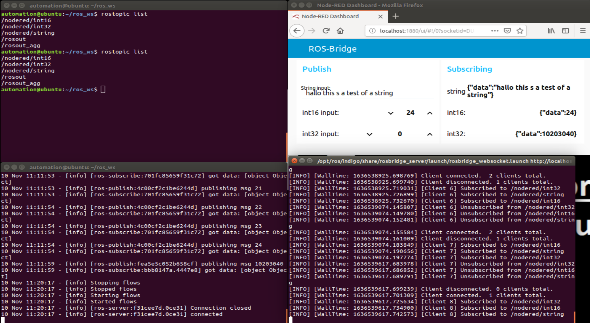

# ROS-and-NodeRed
How to get data from ROS (here good old indigo) via ROS-bridge.
 
**Ubuntu version:**
14.06.4 LTS
 
**ROS Version:**
Indigo

**NodeRed Version**
2.1.3

## Installing Node-Red
Install Node.js, for this older version of Ubuntu i forced it. Thereafter I just used *npm* and the guide at [Node-Red](https://nodered.org/docs/getting-started/local) to install and run NodeRed.

There are one issue, the old firefox in Ubuntu 14.06.04 will not show the Flow side for Node-red at *http://localhost:1880/*, but I just connect via my main PC. 

The Dashboard is no issue.

## Installing and using ROS-web-bridge
[Rosbridge-suite](http://wiki.ros.org/rosbridge_suite)provides a JSON API to ROS functionality for non-ROS programs. To install in indigo use the following command:

'''
sudo apt-get install ros-indigo-rosbridge-server
'''

the pictures and simpel code example late in this document is using the standard *ROS-launch* command

'''
roslaunch rosbridge_server rosbridge_websocket.launch
'''

This will run rosbridge and create a WebSocket on port 9090 by default.

## Node-RED and ROS

[node-red-contrib-ros](https://flows.nodered.org/node/node-red-contrib-ros) have been used (thank you to **nhong**)

## The Flow

**The Node-RED Flow can be found under Code**

## The Dashboard (and ROS Topics)

**As always... Have fun with the data and code**